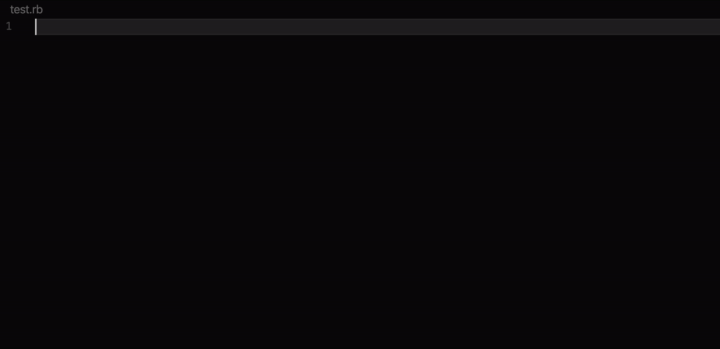

# SerpAPI Snippets for VSCode - Scrape search engine results

Scrape Google and other search engines from our fast, easy, and complete API.

     
SerpAPI snippets contain a collection of 96+ snippets to initialize SerpApi library for many programming languages :
 - Python 3.5+
 - Ruby 2.5+
 - NodeJS / JavaScript
 - Go / Golang
 - C# / CSharp / Dotnet
 - Java 6+
 (soon) - Rust
 (soon) - C++
 (soon) - Perl / Php

The snippets cover the following search engine:
- Google
- Baidu
- Bing
- Ebay
- Yandex
- Yahoo
- Walmart
- Youtube

The (serpapi.com) backend is designed to handle searches at scale on almost any search engine.

## Tutorial

An API Key is required, you need to create a [free or paid plan](https://serpapi.com/).

To get a snippet started typing in an open file.
 * `serpapi google`...
or
 * `serpapi bing`...
or
 * `serpapi <engine>`...

Then select the snippet using the <Enter> key stroke.  
 Paste your API Key into the cursor position, then validate with <Enter>.

To install the library, you must visit [serpapi.com](https://serpapi.com/#integrations)  
Follow the instruction for your favorite programming language.

## Release
see: [CHANGELOG.md](https://github.com/serpapi/serpapi-vscode-snippets/blob/master/CHANGELOG.md)

## TODO
 - [ ] figure out bugs with syntax in PHP
 - [ ] upgrade when new libraries are available.

## Get help
For support, [contact us](https://serpapi.com/#contact).

For technical issues related to those snippets, or suggestions you can file an [issue](https://github.com/serpapi/serpapi-vscode-snippets/issues).
